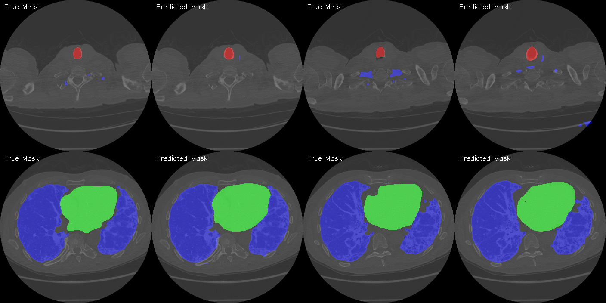
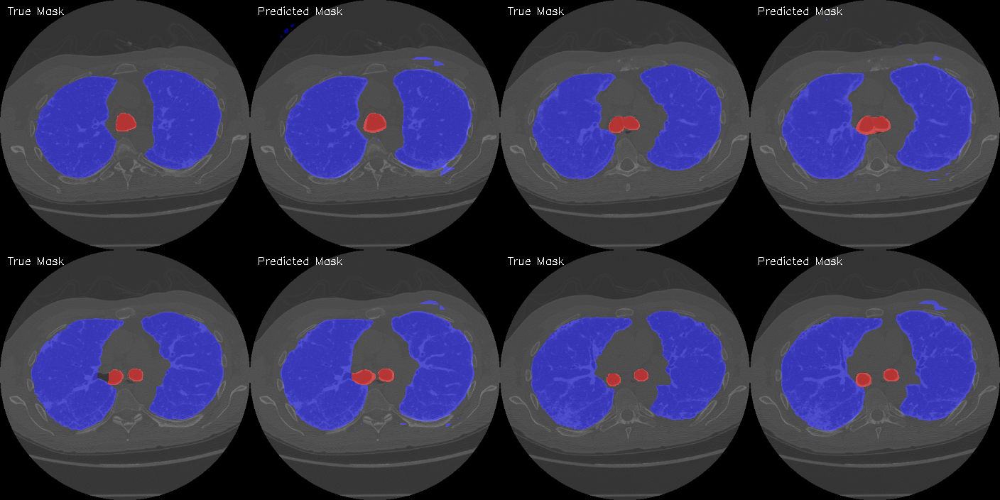
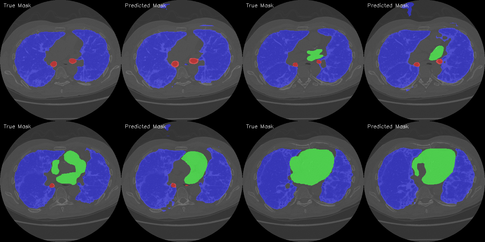
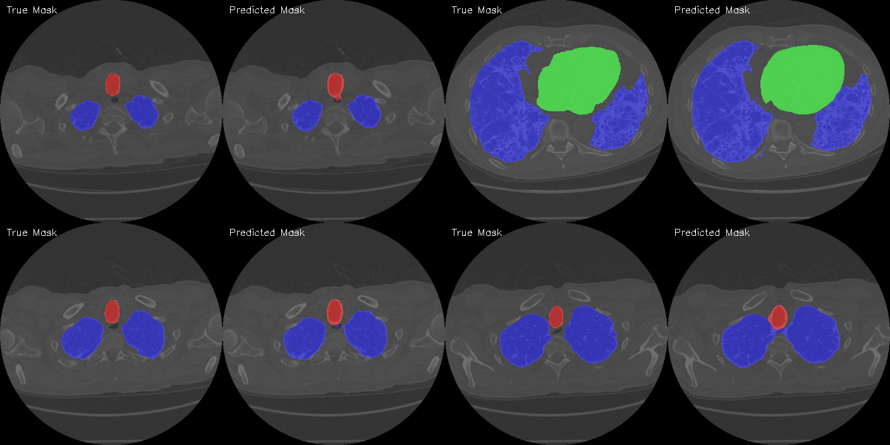
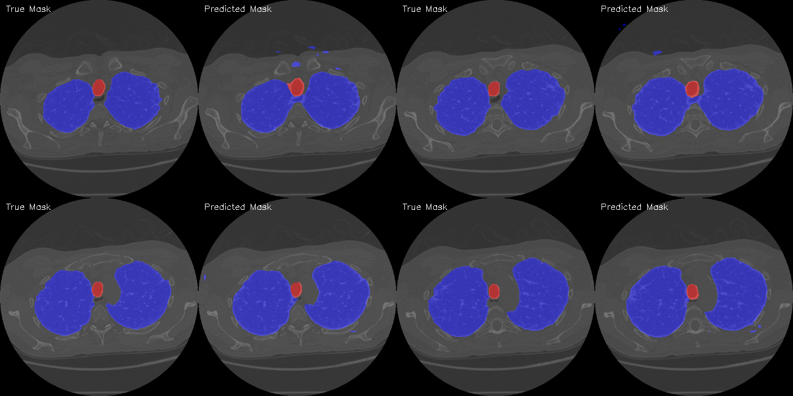

<h2 align="left">Training HarDMSEG for MRI Multiclass Segmentation with lightning code</h2>

###

dataset: https://www.kaggle.com/datasets/polomarco/chest-ct-segmentation                                                                        Each tensor has the following shape: number of slices, width, height, number of classes, where the width and height number of slices are individual parameters of each tensor id, and number of classes = 3.  In addition, the data was re-saved as RGB images, where each image corresponds to one ID slice, and their mask-images have channels corresponding to three classes: (lung, heart, trachea).

This project uses the [HarDNet-MSEG](https://arxiv.org/abs/2101.07172) architecture.
###

Results:

###

  

###

  

###

  

###

  

###

  

###
