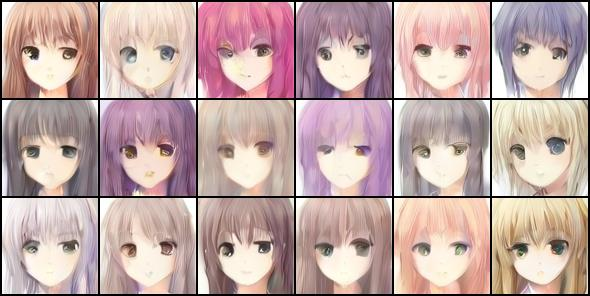
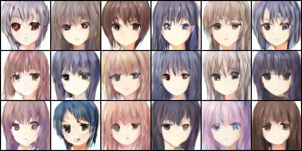
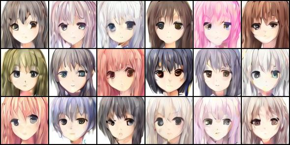
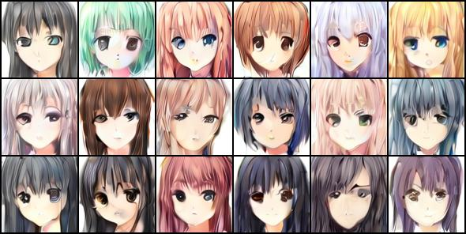
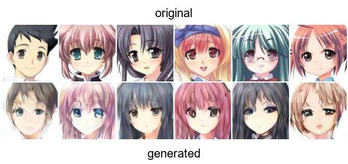
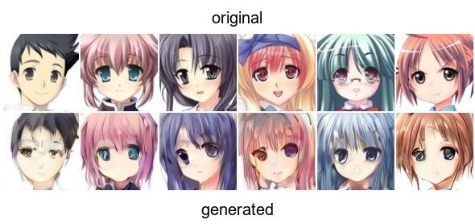
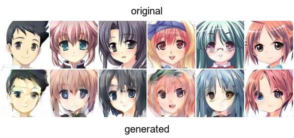

# **Latent Space Diffusion with LookViT Transformer for Anime Face Generation**
## Description
This project implements anime face generation at 96×96 resolution using a diffusion model (DiT) based on a LookViT-style transformer architecture. The model utilizes self-attention and cross-attention mechanisms to process image patches of varying sizes during the denoising process.

Images are first encoded into a compact 12×12×4 latent representation using the SDXL-VAE-FP16-Fix (Stable Diffusion XL) model, which is also used for decoding. These latent representations are precomputed once before training.

The alternative version enhances the original implementation by adding LPIPS loss for better assessment of generated image quality.

## Dataset
The model is trained on the [Anime Face Dataset](https://www.kaggle.com/datasets/splcher/animefacedataset) from Kaggle.

## Results

### Generation from Pure Noise with Different Noise Scaling Factors
  
*Noise scale = 0.6*

  
*Noise scale = 0.7*

  
*Noise scale = 0.8*

  
*Noise scale = 0.85*

### Denoising Original Images at Different Diffusion Steps (out of 500 total steps)
  
*Denoising at step 400*

  
*Denoising at step 300*

  
*Denoising at step 200*
