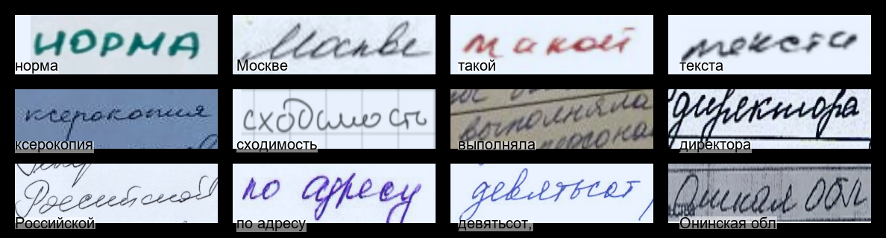
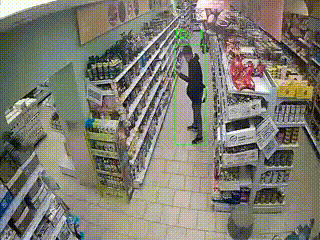
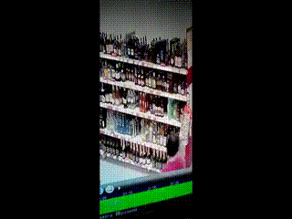
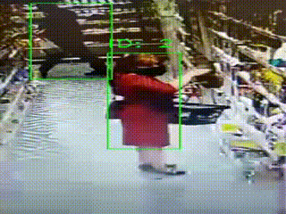

# Computer vision projects.

My projects on machine learning and computer vision are collected here

- [The Russian handwriting recognition model](./handwriting_recognition)  

<table>
  <tr>
    <td style="border: 1px solid #ddd; padding: 10px;">
      
    </td>
    <td style="border: 1px solid #ddd; padding: 10px;">
      
    </td>
  </tr>
</table>

- [Shoplifting Detection Using a Video Classifier](./Shoplifting)  

<table>
  <tr>
    <td style="border: 1px solid #ddd; padding: 10px;">
      
    </td>
    <td style="border: 1px solid #ddd; padding: 10px;">
      
    </td>
    <td style="border: 1px solid #ddd; padding: 10px;">
      
    </td>
  </tr>
</table>

- [AI football game(detection, tracking, position mapping)](./AI_Football_Game)

  

- [Image Retrieval with FAISS and DaViT](./Image_Retrieval.ipynb)

- [Signature verification with Quadruplet Loss](./Signature_Verification.ipynb)

- [Latent Diffusion Generation with LookViT Transformer](./Latent_Diffusion_Generation_with_LookViT_Transformer)

- [Transformer image captioning model](./Transformer_Image_Captioning)  

- [MRI segmentation](./-training_HarDMSEG_for_MRI_segmentation_with_pytorch_lightning_code)  

