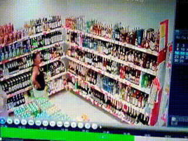
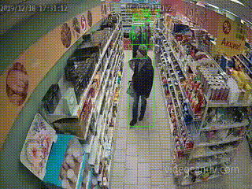
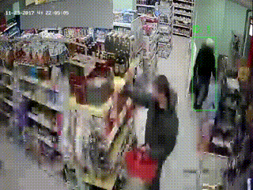

# 🕵️ Shoplifting Detection Using a Video Classifier

This project is a system for detecting shoplifting using computer vision.

It is based on the VideoMAE neural network model, trained for video classification. The model analyzes short 16-frame video fragments and determines whether theft or normal behavior occurs in them.

The system integrates with the YOLO object detector, which finds and tracks people in the frame, after which their actions are transferred to the classifier for analysis.

[Jupyter Notebook](./Shoplifting_Detection.ipynb)

## ✅ Results: Shoplifting Detected
<table>
  <tr>
    <td></td>
    <td></td>
  </tr>
  <tr>
    <td></td>
    <td></td>
  </tr>
</table>

## 🤔 Challenging Case: Placing Items in a Basket
<table>
  <tr>
    <td></td>
    <td></td>
  </tr>
</table>