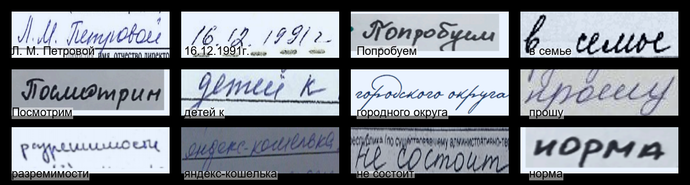

# The Russian handwriting recognition model

Total accuracy for all tokens: 0.9811
Total number of trained parameters: 39891636  

Dataset: [https://www.kaggle.com/datasets/constantinwerner/cyrillic-handwriting-dataset/data](https://www.kaggle.com/datasets/constantinwerner/cyrillic-handwriting-dataset/data)  

Results:  

  
  

  

  

  

  
